# 노코드 업무 자동화 프로젝트 보고서

> 작성자: 신의령  
> 최종 정리일: 2026-07-18  
> 구현 도구: Make, Zapier, Google Forms, Google Sheets, Google Calendar, Discord

---

## 프로젝트 구성

| 구분 | 주제 | 핵심 목표 |
|---|---|---|
| 프로젝트 1 | Make와 Zapier 비교 구현 | 동일한 퀴즈 결과 분류 워크플로우를 두 도구로 구현하고 기능·사용성·실행량을 비교 |
| 프로젝트 2 | 채용공고 지원 일정 등록 및 마감 리마인더 | Google Form으로 입력한 채용공고를 Calendar에 자동 등록하고 우선순위·남은 일수별 Discord 리마인더 전송 |

모든 스크린샷은 저장소의 `images` 폴더에 저장했으며, 프로젝트 1은 `01~30`, 프로젝트 2는 `31~57`의 연속 번호를 사용한다.

### 미션 요구사항 충족 요약

| 요구사항 | 프로젝트 1 | 프로젝트 2 |
|---|---|---|
| 실제 동작하는 워크플로우 | Make·Zapier 실행 결과 및 History 확인 | Make 실행 결과·History·자동 스케줄 ON 확인 |
| Trigger 1개 이상 | Google Sheets 응답 시트의 신규 행 감지 | Make Scheduler `Every 1 hour` |
| Action 2개 이상 | 결과 시트 기록, Discord 알림 | Calendar 생성, Discord 알림, Sheets 상태 업데이트 |
| 조건 분기 1개 이상 | 점수 80점 기준 합격·불합격 분기 | Router 7개 경로 |
| 모든 분기 실행 확인 | 합격·불합격 경로 각각 실행 | 신규 등록 및 리마인더 6개 경로 실행 |
| 보안 조치 | 계정 정보와 Webhook URL 마스킹 | 계정 정보와 Webhook URL 마스킹 |

> 보너스 과제인 생성형 AI Action과 실패 알림·재시도 경로는 선택사항이므로 이번 필수 구현 범위에서는 제외했다.

---

## 프로젝트 1. Make와 Zapier 비교 구현

**주제:** 퀴즈 응시 결과 자동 분류 및 Discord 알림  
**비교 도구:** Make, Zapier

### 1. 개요

#### 1.1 비교 목적

동일한 자동화 워크플로우를 Make와 Zapier에서 각각 구현하여, 과제 수행 당시 무료 플랜 및 무료 체험 환경을 기준으로 기능, 사용성, 분기 방식, 실행량, 디버깅 편의성을 실제 구현 경험에 따라 비교 분석한다.

Zapier 계정은 구현 당시 Pro 무료 체험 상태였으나, 체험 종료 후에도 유지 가능한 구성을 검증하기 위해 Free 플랜의 제약을 전제로 설계했다. 따라서 유료 기능인 Paths와 Webhooks by Zapier는 사용하지 않고, 합격 처리 Zap과 불합격 처리 Zap을 분리하는 방식으로 구현했다.

#### 1.2 구현한 워크플로우

**퀴즈 응시 결과 자동 분류 및 알림**

```text
[입력 이벤트] Google Form 제출
    ↓
Google Sheets 응답 탭에 새 행 저장
    ↓
[자동화 Trigger] Google Sheets 신규 행 감지
    ↓
[조건 판단] 점수 ≥ 80 ?
    ├─ Yes → 처리시각 생성·변환
    │        → 합격자 시트에 이름·점수·처리시각 기록
    │        → Discord 합격 알림 전송
    │
    └─ No  → 처리시각 생성·변환
             → 불합격자 시트에 이름·점수·처리시각 기록
             → Discord 불합격 알림 전송
```

Google Form 제출은 자동화에 사용할 데이터를 생성하는 입력 이벤트이며, Make와 Zapier의 실제 Trigger는 연결된 Google Sheets 응답 탭에서 신규 행을 감지하는 단계이다.

- 논리 구성: Trigger 1개 + 조건 분기 1개 + 처리시각 생성·변환 + 결과 기록/알림 Action 4개
- 연동 서비스: Google Forms, Google Sheets, Discord
- 결과 시트 컬럼: `이름 / 점수 / 처리시각`
- Discord 메시지 포함 정보: 이름, 점수, 처리 결과, 처리시각

#### 1.3 동일한 워크플로우 구조 구현 원칙

Make와 Zapier의 실제 구현 단위에는 차이가 있다. Make는 하나의 시나리오에서 Router로 합격과 불합격 경로를 분리했고, Zapier는 무료 플랜의 기능 제한을 고려하여 합격 처리 Zap과 불합격 처리 Zap을 각각 구성했다.

그러나 두 도구 모두 다음과 같은 동일한 논리적 업무 흐름을 유지했다.

```text
Google Form 응답
→ Google Sheets 신규 행 감지
→ 점수 80점 기준 판단
→ 합격자 또는 불합격자 시트 기록
→ Discord 결과 알림
```

즉, 도구별 화면 구성과 분기 구현 방식은 다르지만 입력 데이터, 판단 기준, 결과 저장 위치, 최종 알림이라는 핵심 구조는 동일하다.

처리시각은 자동화가 실제로 데이터를 처리한 시점을 기록하기 위해 추가하였다. 특히 Zapier에서는 기본 현재 시각이 UTC로 입력되어 한국 시간과 9시간 차이가 발생했기 때문에, `Formatter by Zapier`를 사용하여 UTC 시간을 `Asia/Seoul`로 변환한 뒤 Google Sheets와 Discord에 전달했다.

---

### 2. 구현 방식 비교

#### 2.1 전체 구조 차이

| 항목 | Make | Zapier |
|---|---|---|
| 워크플로우 개수 | 시나리오 1개 | Zap 2개: 합격 처리용, 불합격 처리용 |
| 분기 처리 방식 | Router에서 조건별 경로를 시각적으로 분리 | Filter에서 조건 미충족 시 실행 중단 |
| 무료 환경에서의 우회 방식 | 하나의 시나리오 안에서 합격·불합격 분기 구현 | 합격 Zap과 불합격 Zap을 별도로 생성 |
| 처리시각 반영 | 결과 기록 시 처리시각 값을 함께 매핑 | Formatter로 UTC → Asia/Seoul 변환 후 매핑 |
| 실제 Zapier 스텝 | 해당 없음 | 각 Zap마다 Trigger → Filter → Formatter → Sheets → Discord |

**체감 소감:**  
Make는 Router를 사용해 한 화면에서 합격과 불합격 흐름을 함께 확인할 수 있어 전체 구조 파악과 수정이 편했다. 반면 Zapier는 동일한 로직을 합격용과 불합격용 Zap으로 분리해야 했기 때문에 조건, 시트 탭, Discord 문구를 각각 관리해야 했다. 특히 처리시각 변환 로직도 두 Zap에 동일하게 유지해야 하므로, 이후 수정이 생기면 두 Zap을 함께 점검해야 한다는 번거로움이 있었다.

#### 2.2 Zapier의 실제 5단계 구성

##### 합격 처리 Zap

```text
1. Google Sheets — New Spreadsheet Row
2. Filter by Zapier — 점수 (Number) Greater than 79
3. Formatter by Zapier — Current time: UTC (ISO) → Asia/Seoul
4. Google Sheets — 합격자 탭에 새 행 생성
5. Discord — 합격 알림 전송
```

##### 불합격 처리 Zap

```text
1. Google Sheets — New Spreadsheet Row
2. Filter by Zapier — 점수 (Number) Less than 80
3. Formatter by Zapier — Current time: UTC (ISO) → Asia/Seoul
4. Google Sheets — 불합격자 탭에 새 행 생성
5. Discord — 불합격 안내 전송
```

#### 2.3 Discord 연동 방식 차이

| 항목 | Make | Zapier |
|---|---|---|
| 사용한 방식 | HTTP 모듈 + Discord Webhook URL | Discord 공식 앱 연동 |
| 설정 방식 | Webhook URL과 JSON Body를 직접 작성 | Discord 봇 권한 승인 후 채널 선택 |
| 설정 난이도 | HTTP 구조와 JSON 형식을 이해해야 함 | 채널과 메시지 필드 중심으로 설정 가능 |
| 유연성 | HTTP 요청을 자유롭게 구성 가능 | 공식 앱 필드 안에서 비교적 간단하게 설정 |
| 보안 주의점 | Webhook URL이 노출되지 않도록 마스킹 필요 | 계정·서버 권한 화면의 개인정보 노출 주의 |

#### 2.4 처리시각 구현 차이

이번 구현에서는 단순히 이름과 점수만 저장하지 않고, 자동화가 결과를 처리한 시간을 함께 기록했다.

Zapier에서 처음 `Current time` 값을 Google Sheets에 직접 입력했을 때 한국 시간 오후 4시가 오전 7시로 기록되었다. 이는 기본 시간이 UTC 기준이었기 때문이다. 이를 해결하기 위해 다음 Formatter 설정을 추가했다.

```text
Input: Current time: UTC (ISO)
From Timezone: UTC
To Timezone: Asia/Seoul
To Format: YYYY-MM-DD HH:mm:ss Z
```

변환 결과 예시:

```text
2026-07-16 16:44:52 +0900
```

Formatter의 `Output`을 Google Sheets의 `처리시각` 컬럼과 Discord 메시지의 처리시각 항목에 연결하여 한국 표준시로 기록되도록 수정했다.

#### 2.5 스크린샷 증거

캡처 파일은 Make와 Zapier를 합쳐 하나의 연속 번호 체계로 정리하였다. 모든 이미지는 GitHub 저장소의 `images` 폴더에 저장한다.

##### 무료 플랜 및 전체 구조

| 항목 | 이미지 |
|---|---|
| Make 무료 플랜 대시보드 |  |
| Zapier Pro 무료 체험 대시보드 |  |
| Make 전체 시나리오와 Router 분기 |  |
| Zapier 합격 처리 Zap 전체 구성 |  |
| Zapier 불합격 처리 Zap 전체 구성 |  |
| Zapier 두 Zap 활성화 목록 |  |

##### 조건 설정과 시간대 변환

| 항목 | 이미지 |
|---|---|
| Make Router 합격 필터 |  |
| Make Router 불합격 필터 |  |
| Zapier 합격 필터 |  |
| Zapier 시간대 변환 Formatter |  |
| Zapier 불합격 필터 |  |

##### 실행 결과와 로그

| 항목 | 이미지 |
|---|---|
| Make 합격 경로 실행 성공 |  |
| Make 불합격 경로 실행 성공 |  |
| Make 합격자 시트 결과 | 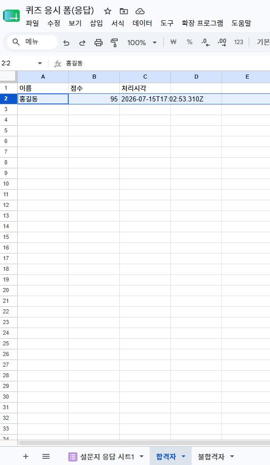 |
| Make 불합격자 시트 결과 | 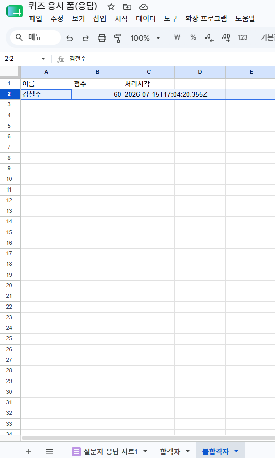 |
| Make Discord 합격·불합격 알림 | 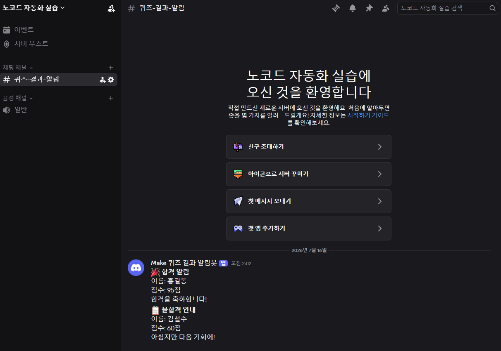 |
| Make 실행 History |  |
| Zapier 합격자 시트 결과 |  |
| Zapier 불합격자 시트 결과 |  |
| Zapier Discord 최종 알림 |  |
| Zapier 실행 History |  |
| Zapier Filtered 상세 로그 |  |
| Zapier Task 사용량 |  |

> 모든 스크린샷에서 Webhook URL, 이메일 주소, 계정 정보 등 민감정보는 마스킹하거나 화면에서 제외하였다.

---

### 3. 사용성 비교

#### 3.1 UI/UX

| 항목 | Make | Zapier |
|---|---|---|
| 편집 방식 | 캔버스 기반으로 모듈과 Router를 자유롭게 배치 | 위에서 아래로 이어지는 세로 스텝 방식 |
| 전체 흐름 파악 | 분기 구조가 한 화면에 보여 직관적 | 각 Zap은 단순하지만 전체 분기를 보려면 두 Zap을 함께 확인해야 함 |
| 초보자 접근성 | 처음에는 용어와 데이터 번들 구조가 낯설 수 있음 | Setup → Configure → Test 순서가 명확함 |
| 데이터 매핑 | 모듈 출력 필드를 선택해 연결 | 이전 Step 데이터와 Variables를 검색해 삽입 |
| 테스트 방식 | `Run once`로 시나리오 전체 실행 | 각 Step의 `Test step`을 순차적으로 실행 |
| 처리시각 수정 | 매핑 또는 날짜 함수 활용 | Formatter를 추가해 시간대 변환 |

#### 3.2 실행 로그와 디버깅

- **Make:** History에서 실행별로 모듈의 입력과 출력 Bundle을 확인할 수 있어, 어느 모듈에서 값이 잘못 전달됐는지 추적하기 편했다.
- **Zapier:** Zap History에서 `Successful`, `Filtered` 상태가 명확하게 구분됐다. Filtered 실행을 열면 입력 점수와 함께 `This filter successfully stopped your run.` 문구를 확인할 수 있었고, 이후 Formatter·Google Sheets·Discord 단계가 실행되지 않았다는 점도 확인할 수 있었다.
- **처리시각 디버깅:** Zapier에서 처리시각이 9시간 차이 나는 문제를 Formatter 단계의 입력 시간대와 출력 시간대를 명시해 해결했다.

#### 3.3 구현 중 겪은 문제와 해결

| 문제 | 원인 | 해결 |
|---|---|---|
| 점수 조건 비교가 잘못될 가능성 | Text 연산자를 사용하면 숫자가 문자열 방식으로 비교될 수 있음 | Filter 조건을 `(Number)` 연산자로 설정 |
| Zapier에서 한국 시간보다 9시간 이전으로 기록됨 | `Current time`이 UTC 기준으로 처리됨 | Formatter에서 UTC → Asia/Seoul로 변환 |
| Zapier에서 하나의 Zap으로 양쪽 분기를 구현하기 어려움 | Paths가 무료 환경에서 제한됨 | 합격 Zap과 불합격 Zap을 별도로 생성 |
| Zap 복제 후 합격 설정이 남아 있음 | Duplicate 시 기존 Filter, Worksheet, Discord 문구가 그대로 복제됨 | 불합격 Zap에서 Filter, Worksheet, Discord 문구를 각각 수정 |
| Worksheet 변경 후 매핑 초기화 가능성 | 시트 탭 변경 시 필드 구조를 다시 불러옴 | 이름, 점수, 처리시각 매핑을 다시 확인 |
| 테스트 데이터가 조건에 맞지 않아 Filter 테스트 실패 | 합격용 95점 데이터가 불합격 Zap에 남아 있었음 | Trigger 테스트 레코드를 80점 미만 데이터로 교체 |

---

### 4. 무료 플랜 및 실행량 비교

> 아래 내용은 과제 수행 당시 확인한 플랜 화면과 실제 실행 결과를 기준으로 작성했다.

| 항목 | Make Free | Zapier 무료 환경/체험 환경 |
|---|---|---|
| 월 실행 한도 | 1,000 Operations | Free 기준 100 Tasks |
| 과금 단위 | 모듈 1회 실행마다 Operation 사용 | 성공적으로 실행된 Action마다 Task 사용 |
| Trigger·조건 처리 | 실행된 모듈 기준으로 Operation 반영 | Trigger와 Filter는 Billable Task에서 제외 |
| 처리시각 변환 | Google Sheets 기록 모듈에서 처리시각 값을 함께 매핑해 별도 변환 모듈 없이 기록했으므로 추가 Operation이 발생하지 않음 | Formatter 단계는 존재하지만 실제 성공 실행은 2 Tasks로 기록됨 |
| 이번 프로젝트 성공 1건 | 시나리오의 실제 실행 모듈 수에 따라 계산 | Google Sheets 기록 1 + Discord 전송 1 = 2 Tasks |
| Filtered 실행 | Router/필터까지 실행된 모듈 기준 사용 | 후속 Action이 실행되지 않아 0 Tasks |
| 분기 구현 | Router 사용 가능 | Paths 대신 Zap 2개로 우회 |
| HTTP/Webhook | HTTP 모듈 활용 가능 | Webhooks by Zapier는 프리미엄 앱 |
| 최소 폴링 간격 | 15분 | 15분 |

#### 4.1 실제 Zapier Task 사용량

최종 테스트에서는 합격 응답 1건과 불합격 응답 1건을 처리했다.

```text
합격 처리 Zap 성공: 2 Tasks
불합격 처리 Zap 성공: 2 Tasks
반대 조건의 Filtered 실행: 각각 0 Tasks
총 Billable Zap Tasks: 4
```

Zapier Task Usage 화면에서도 두 Zap이 각각 2 Tasks를 사용하여 총 4 Billable Tasks가 발생한 것으로 확인됐다.

#### 4.2 실행량 분석

이번 워크플로우에서 Zapier는 성공한 응답 1건당 2 Tasks를 사용했다. 따라서 월 100 Tasks를 단순 적용하면 약 50건의 최종 처리까지 가능하다. 반면 Make는 모듈 단위로 Operation이 계산되므로 시나리오가 복잡해질수록 한 건당 소모량이 증가할 수 있지만, 월 제공량 자체는 더 크다.

단순한 실행 횟수만 보면 Make가 여유롭지만, 실제 효율은 시나리오에서 몇 개의 모듈이 실행되는지와 Router 이후 어느 경로가 동작하는지까지 함께 고려해야 한다.

---

### 5. 도구별 장단점 정리

| 도구 | 장점 | 단점 |
|---|---|---|
| Make | Router로 여러 분기를 한 화면에서 관리할 수 있고, HTTP 모듈과 상태값을 활용한 복잡한 자동화에 적합하다. 무료 플랜의 월 실행량도 비교적 여유롭다. | 데이터 Bundle, 모듈 매핑, HTTP JSON Body 등 초기에 익혀야 할 개념이 많아 학습 곡선이 있다. |
| Zapier | Setup → Configure → Test의 단계형 UI가 직관적이고, Discord 공식 앱처럼 지원되는 앱은 연결과 테스트가 간단하다. | 무료 환경에서는 Paths와 일부 프리미엄 기능이 제한되어 복수 분기를 여러 Zap으로 나눠야 할 수 있고, 중복된 설정을 함께 관리해야 한다. |

### 6. 종합 평가

#### 6.1 항목별 평가

| 평가 항목 | Make | Zapier | 비고 |
|---|---:|---:|---|
| 무료 플랜 실용성 | 5.0 | 3.0 | Make는 Router와 HTTP 활용이 가능하고 실행 한도가 큼 |
| 분기/로직 표현력 | 5.0 | 2.5 | Make는 한 시나리오에서 분기, Zapier는 두 Zap으로 분리 |
| 초보자 진입 장벽 | 3.5 | 4.5 | Zapier의 단계형 UI가 처음 사용하기 쉬움 |
| 연동 앱 설정 편의성 | 4.0 | 4.5 | Zapier Discord 공식 앱 설정이 간단했음 |
| 디버깅/로그 | 4.5 | 4.0 | Make는 모듈별 데이터, Zapier는 상태 구분이 명확 |
| 유지보수 편의성 | 4.5 | 3.0 | Zapier는 두 Zap과 Formatter 설정을 함께 관리해야 함 |
| **총점** | **26.5 / 30** | **21.5 / 30** | 이번 과제 기준 |

#### 6.2 상황별 추천

- **Make 추천:** 합격/불합격처럼 여러 조건 분기가 필요하거나, HTTP·Webhook을 자유롭게 사용해야 하며, 무료 환경에서 비교적 많은 실행량이 필요한 경우
- **Zapier 추천:** 로직이 단순하고, 공식 앱 연결을 이용해 빠르게 자동화를 만들고 싶은 경우
- **시간대 처리가 중요한 경우:** 어느 도구를 사용하든 서비스별 기본 시간대를 반드시 확인해야 하며, 기록 결과가 UTC로 저장되는지 테스트해야 한다.

#### 6.3 결론

이번 미션에서는 무료 환경에서 Router와 HTTP 기능을 활용해 하나의 시나리오로 전체 흐름을 구성할 수 있었던 Make가 더 적합했다. 합격과 불합격 경로를 한 화면에서 확인할 수 있어 구조 이해와 유지보수가 편했고, 실행 한도도 상대적으로 여유로웠다.

Zapier는 Setup → Configure → Test로 이어지는 단계형 UI와 Discord 공식 앱 연동이 직관적이라는 장점이 있었다. 그러나 무료 환경에서는 합격과 불합격 분기를 위해 두 개의 Zap을 별도로 관리해야 했고, 처리시각의 UTC 문제를 해결하기 위해 각 Zap에 Formatter 단계를 추가해야 했다. 그 결과 각 Zap은 `Trigger → Filter → Formatter → Google Sheets → Discord`의 5단계 구조가 되었다.

최종적으로 이번 과제처럼 조건 분기와 Webhook 활용이 중요한 워크플로우에는 Make가 더 효율적이었다. 반면 단일 조건과 단순한 공식 앱 연동이 중심인 업무에서는 Zapier가 더 빠르게 구축할 수 있는 도구라고 판단했다.

---

## 프로젝트 2. 채용공고 지원 일정 등록 및 마감 리마인더

### 1. 반복 업무 정의와 도구 선정

#### 1.1 자동화할 반복 업무

채용공고를 여러 사이트에서 확인하다 보면 회사명, 포지션, 지원 마감일, 제출 항목을 각각 정리하고 Calendar에 다시 입력해야 한다. 또한 마감일이 가까워질 때마다 우선순위를 확인하고 별도로 알림을 설정해야 하므로 반복 작업과 누락 가능성이 발생한다.

**반복 업무 정의:** 채용공고를 발견할 때마다 공고 정보를 Google Sheets에 정리하고, Google Calendar에 지원 마감 일정을 등록한 뒤, 우선순위와 마감일까지 남은 기간에 맞춰 별도의 리마인더를 설정하는 업무를 자동화 대상으로 선정했다.

#### 1.2 선정 도구와 선정 이유

- **선정 도구:** Make
- **선정 이유:** 프로젝트 2는 신규 공고 등록과 우선순위·남은 일수에 따른 다수의 조건 분기, Discord Webhook 전송, Google Sheets 상태값 업데이트를 하나의 흐름에서 관리해야 한다. Make는 Router와 Filter로 여러 경로를 시각적으로 구성할 수 있고, 과제 수행 당시 무료 환경에서도 HTTP 모듈을 활용할 수 있어 이번 업무에 적합하다고 판단했다.
- **Zapier 대신 Make를 선택한 이유:** 프로젝트 1에서 확인한 것처럼 Zapier 무료 환경에서는 복수 분기를 여러 Zap으로 분리해야 할 가능성이 있다. 반면 Make는 하나의 시나리오에서 신규 공고 경로와 6개 리마인더 경로를 함께 관리할 수 있어 수정과 유지보수가 더 편리하다.

프로젝트 2에서는 Google Form에 채용공고를 한 번 입력하면 다음 작업이 자동으로 수행되도록 Make 시나리오를 설계했다.

- Google Sheets에 공고 데이터 누적
- Google Calendar에 지원 마감 일정 생성
- Discord에 신규 공고 등록 완료 알림 전송
- 우선순위와 남은 일수에 따라 D-7, D-3, D-1 리마인더 전송
- 처리 상태를 Google Sheets에 기록하여 중복 등록과 중복 알림 방지
- 매시간 자동 실행

### 2. 전체 워크플로우

```text
[입력 이벤트] Google Form 응답 제출
        ↓
Google Sheets 응답 시트에 새 행 저장

[Make Trigger] Scheduler — Every 1 hour
        ↓
Google Sheets — Search Rows
        ↓
Router
├─ 신규 공고_캘린더 미등록
│   ├─ Google Calendar 일정 생성
│   ├─ Discord 신규 공고 Embed 알림
│   └─ Google Sheets I열 = 완료
│
├─ 상_D7
├─ 상_D3
├─ 상_D1
├─ 중_D7
├─ 중_D3
└─ 하_D7
    ├─ Discord 마감 리마인더 Embed 알림
    └─ Google Sheets H열 = D-7 / D-3 / D-1
```

Google Form 제출은 데이터를 생성하는 입력 이벤트이고, Make 시나리오를 실제로 시작하는 Trigger는 `Every 1 hour`로 설정한 Scheduler이다. Scheduler가 실행될 때마다 Google Sheets의 처리 대상 행을 조회하고, Router의 조건에 따라 필요한 Action만 수행한다.

테스트 완료 후 스케줄을 ON 상태로 전환하여 Trigger 발생 시 자동 실행되는 구조를 완성했다.

#### 2.1 Trigger·조건 분기·Action 구성

| 구분 | 구성 요소 | 역할 |
|---|---|---|
| 입력 이벤트 | Google Form 응답 제출 | 채용공고 데이터를 Google Sheets에 저장 |
| Trigger | Make Scheduler — `Every 1 hour` | 시나리오를 매시간 자동 시작 |
| 조회 Action | Google Sheets — Search Rows | 미처리 공고와 리마인더 대상 행 조회 |
| 조건 분기 | Router + 경로별 Filter | 신규 등록 및 우선순위·남은 일수에 따라 경로 선택 |
| Action 1 | Google Calendar — 일정 생성 | 지원 마감일을 종일 일정으로 등록 |
| Action 2 | Discord Webhook — Embed 전송 | 신규 공고 또는 마감 리마인더 알림 전송 |
| Action 3 | Google Sheets — Update Cell | 캘린더등록·알림완료 상태를 기록하여 중복 실행 방지 |

### 3. 입력 데이터와 Google Sheets 구조

Google Form에는 다음 항목을 구성했다.

| 항목 | 용도 |
|---|---|
| 회사명 | 지원 기업 식별 |
| 포지션 | 채용 직무 |
| 지원 링크 | 공고 원문 또는 지원 페이지 |
| 지원 마감일 | Calendar 일정과 D-Day 계산 기준 |
| 우선순위 | 상·중·하 리마인더 분기 |
| 제출 항목 | 이력서, 포트폴리오, 과제 등 준비 자료 |

연결된 Google Sheets는 다음 열을 사용한다.

| 열 | 필드 | 역할 |
|---|---|---|
| A | 타임스탬프 | Form 제출 시각 |
| B | 회사명 | 공고 기본 정보 |
| C | 포지션 | 공고 기본 정보 |
| D | 지원 링크 | Discord 지원 링크 |
| E | 지원 마감일 | Calendar 시작일 및 D-Day 기준 |
| F | 우선순위 | Router 분기 조건 |
| G | 제출 항목 | Discord 알림 본문 |
| H | 알림완료 | D-7·D-3·D-1 발송 상태 |
| I | 캘린더등록 | 신규 Calendar 등록 상태 |
| J | 종료일 | 종일 일정 종료일 계산 |
| K | 남은일수 | `지원 마감일 - TODAY()` |
| L | 리마인더허용 | 오전 9시 이후 TRUE |

#### 보조 열 수식

```gs
J2
=ARRAYFORMULA(IF(E2:E="","",TEXT(E2:E+1,"yyyy-mm-dd")))
```

```gs
K2
=ARRAYFORMULA(IF(E2:E="","",E2:E-TODAY()))
```

```gs
L2
=ARRAYFORMULA(IF(E2:E="","",HOUR(NOW())>=9))
```

Google Calendar의 종일 일정 종료일은 마지막 날짜를 포함하지 않는 방식으로 처리되므로, J열에는 지원 마감일 다음 날을 계산하여 전달했다.

### 4. Make 모듈 구성

#### 4.1 Google Sheets — Search Rows

| 설정 | 값 |
|---|---|
| 대상 시트 | `설문지 응답 시트1` |
| Table contains headers | Yes |
| Column range | `A-Z` |
| Limit | `100` |

Search Rows가 가져온 각 행은 Router의 7개 경로로 전달된다.

#### 4.2 신규 공고 등록 경로

신규 공고 경로는 `캘린더등록(I)`이 비어 있는 행만 통과한다.

```text
조건: 캘린더등록(I) = 빈칸
```

통과한 행은 다음 순서로 처리된다.

1. Google Calendar에 종일 일정 생성
2. Discord에 초록색 Embed 카드 전송
3. Google Sheets I열에 `완료` 기록

Calendar 설정은 다음과 같다.

| 항목 | 매핑 |
|---|---|
| Event name | 회사명 · 포지션 |
| All Day Event | Yes |
| Start Date | 지원 마감일(E) |
| End Date | 종료일(J) |
| Description | 우선순위, 제출 항목, 지원 링크 |

#### 4.3 리마인더 경로 조건

대표 설정 화면은 `상_D7` 경로를 캡처했고, 나머지 경로는 동일한 구조에서 우선순위·남은일수·중복 방지 D값만 변경했다.

| 경로 | 우선순위 | 남은일수 | H열 중복 방지 조건 |
|---|---|---:|---|
| 상_D7 | 상 | 7 | `D-7` 미포함 |
| 상_D3 | 상 | 3 | `D-3` 미포함 |
| 상_D1 | 상 | 1 | `D-1` 미포함 |
| 중_D7 | 중 | 7 | `D-7` 미포함 |
| 중_D3 | 중 | 3 | `D-3` 미포함 |
| 하_D7 | 하 | 7 | `D-7` 미포함 |

모든 리마인더 경로에는 다음 조건을 공통으로 적용했다.

```text
리마인더허용(L) = TRUE
캘린더등록(I) = 완료
알림완료(H)에 해당 D값이 포함되지 않음
```

리마인더 전송이 끝나면 H열에 해당 값을 기록한다.

```text
상_D7 / 중_D7 / 하_D7 → H열 = D-7
상_D3 / 중_D3          → H열 = D-3
상_D1                  → H열 = D-1
```

### 5. Discord Embed 알림 설계

#### 5.1 신규 공고 등록 알림

신규 공고는 완료 상태를 직관적으로 구분할 수 있도록 초록색 Embed를 사용했다.

| 항목 | 설정 |
|---|---|
| Title | `✅ 신규 채용공고 등록 완료` |
| Color | `2278750` (`#22C55E`) |
| Footer | `📅 Google Calendar 지원 마감 일정 등록 완료` |

본문에는 회사명, 포지션, 지원 마감일, 우선순위, 제출 항목, 지원 링크를 표시했다.

#### 5.2 마감 리마인더

대표 설정 화면은 `상_D7` 한 장만 사용하고, 나머지 문구와 색상 차이는 아래 표로 정리했다.

| 경로 | 아이콘·핵심 문구 | Color 정수 | 색상 의미 |
|---|---|---:|---|
| 상_D7 | 🚨 지원 일정을 확인하세요!!! | `16347926` | 주황 |
| 상_D3 | 🚨 지원 마감 임박!!! | `15680580` | 빨강 |
| 상_D1 | 🚨 지원 마감이 내일입니다!!! | `10033947` | 진한 빨강 |
| 중_D7 | ⏰ 지원 일정을 확인하세요! | `16436245` | 노랑 |
| 중_D3 | ⏰ 지원 마감 임박! | `16096779` | 황금색 |
| 하_D7 | 📌 지원 일정을 확인하세요. | `6583435` | 청회색 |

공통 Embed 구조는 다음과 같다.

```text
┏━━━━━━━━━━━━━━━━━━
🚨 **[D-7] 회사명 · 포지션**
**지원 일정을 확인하세요!!!**

📝 **제출 항목**
제출 항목 값

🔗 **바로 지원**
지원 링크
┗━━━━━━━━━━━━━━━━━━
```

Discord Embed의 Color 필드는 HEX 문자열이 아니라 정수값을 입력해야 했기 때문에, 각 HEX 색상을 10진수 정수로 변환해 적용했다.

### 6. 최종 테스트 데이터

테스트 기준일은 `2026-07-18`이며, 모든 경로가 최소 한 번씩 실행되도록 6건을 제출했다.

| 회사명 | 포지션 | 마감일 | 우선순위 | 제출 항목 | 지원 링크 | 예상 경로 |
|---|---|---|---|---|---|---|
| 네오브릿지테크 | 백엔드 개발자 | 2026-07-25 | 상 | 이력서, 포트폴리오, 자기소개서 | `https://example.com/jobs/neobridge-backend` | 상_D7 |
| 픽셀웨이브랩 | 프론트엔드 개발자 | 2026-07-21 | 상 | 이력서, GitHub 주소, 사전 과제 | `https://example.com/jobs/pixelwave-frontend` | 상_D3 |
| 데이터스프링 | 데이터 분석가 | 2026-07-19 | 상 | 이력서, 경력기술서, 분석 프로젝트 자료 | `https://example.com/jobs/dataspring-analyst` | 상_D1 |
| 모먼트서비스 | 서비스 운영 담당자 | 2026-07-25 | 중 | 이력서, 자기소개서 | `https://example.com/jobs/moment-operations` | 중_D7 |
| 브라이트마케팅 | 마케팅 인턴 | 2026-07-21 | 중 | 이력서, 콘텐츠 기획안, 포트폴리오 | `https://example.com/jobs/bright-marketing-intern` | 중_D3 |
| 스토리포레스트 | 콘텐츠 에디터 | 2026-07-25 | 하 | 이력서, 작성 기사 샘플 | `https://example.com/jobs/storyforest-editor` | 하_D7 |

Google Sheets에서 계산된 남은일수는 `7 / 3 / 1 / 7 / 3 / 7`이었고, 테스트 시각이 오전 9시 이후였기 때문에 L열은 모두 `TRUE`로 계산됐다.

### 7. 테스트 절차와 결과

#### 7.1 실행 전 상태

Google Form 응답 6건이 Sheets에 저장된 뒤, Make 실행 전에는 다음 상태였다.

```text
H 알림완료: 모두 빈칸
I 캘린더등록: 모두 빈칸
J 종료일: 자동 계산 완료
K 남은일수: 7 / 3 / 1 / 7 / 3 / 7
L 리마인더허용: 모두 TRUE
```

#### 7.2 1차 실행 — 신규 공고 등록

첫 번째 `Run once`에서는 6개 행이 신규 공고 경로를 통과했다.

- Google Calendar 일정 6건 생성
- Discord 신규 공고 Embed 알림 6건 전송
- Google Sheets I열 6건에 `완료` 기록
- H열은 아직 빈칸 유지

#### 7.3 2차 실행 — 리마인더 6개 경로

두 번째 `Run once`에서는 I열이 `완료`인 행만 리마인더 조건을 검사했다. 테스트 데이터가 각 조건에 맞게 구성되어 다음 6개 경로가 각각 1회 실행됐다.

```text
상_D7: 1회
상_D3: 1회
상_D1: 1회
중_D7: 1회
중_D3: 1회
하_D7: 1회
```

Discord에는 우선순위와 D-Day별 색상 Embed가 전송됐으며, Google Sheets H열에는 각 행의 `D-7`, `D-3`, `D-1` 상태가 기록됐다.

#### 7.4 3차 실행 — 중복 발송 차단

시트 값을 수정하지 않고 세 번째 `Run once`를 실행했다. I열의 `완료`와 H열의 D값 때문에 Calendar 생성, 신규 공고 Discord 전송, 리마인더 전송이 모두 차단됐다.

이를 통해 상태값을 이용한 중복 방지 로직이 정상 작동함을 확인했다.

### 8. 구현 중 문제와 해결

| 문제 | 원인 | 해결 |
|---|---|---|
| Google Calendar 일정 생성 시 날짜 오류 | 종일 일정의 종료일 형식과 범위가 맞지 않음 | J열에 `지원 마감일 + 1일`을 `yyyy-mm-dd`로 계산하여 End Date에 매핑 |
| 마감일 값이 Make에서 예상과 다르게 처리됨 | Google Sheets 날짜 표시 형식과 Make 입력 형식 차이 | E열을 `yyyy-mm-dd` 사용자 지정 형식으로 통일 |
| ARRAYFORMULA가 `#REF!` 표시 | J·K·L열 아래 범위에 남아 있던 값 또는 수식이 배열 결과 확장을 방해 | 배열 결과가 펼쳐질 범위를 비운 뒤 J2·K2·L2에만 수식을 다시 입력 |
| Discord Embed 색상 코드 입력 오류 | Color 필드가 `#HEX` 문자열이 아닌 정수형 값을 요구 | HEX 색상을 10진수 정수로 변환하여 입력 |
| Discord 알림이 연속 메시지로 붙어 보여 구분이 어려움 | 동일한 Webhook 메시지가 짧은 간격으로 연속 전송 | Embed 카드, 우선순위별 색상, `┏━━ / ┗━━` 구분선을 적용 |
| 같은 공고나 리마인더가 반복될 가능성 | Search Rows가 매시간 기존 행도 다시 조회 | I열 `완료`, H열 D값을 필터 조건에 포함해 후속 Action 차단 |

### 9. 스크린샷 증거

#### 9.1 입력 화면과 보조 열

| 항목 | 이미지 |
|---|---|
| Google Form 채용공고 입력 화면 | 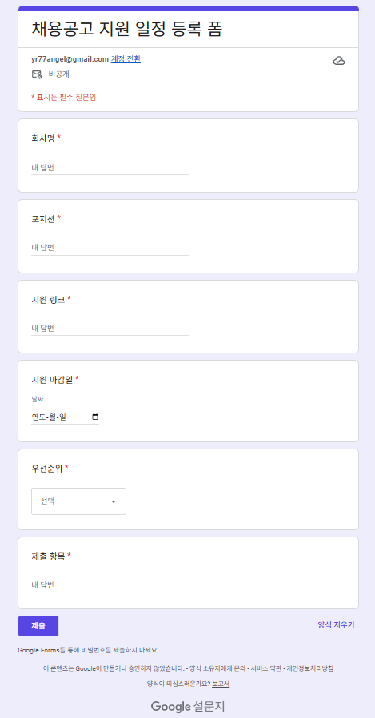 |
| Google Sheets 응답 시트 초기 구조 | 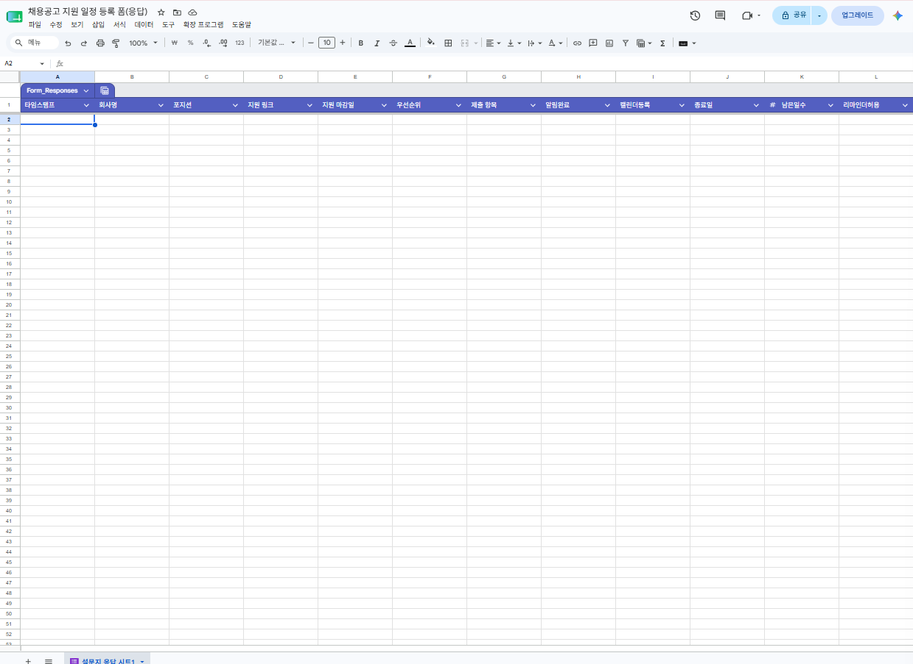 |
| 종료일 J2 ARRAYFORMULA | 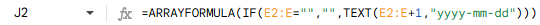 |
| 남은일수 K2 ARRAYFORMULA | 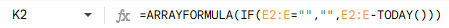 |
| 리마인더허용 L2 ARRAYFORMULA | 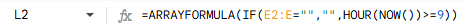 |

#### 9.2 Make 시나리오와 핵심 설정

| 항목 | 이미지 |
|---|---|
| 전체 시나리오와 Router 7개 경로 | 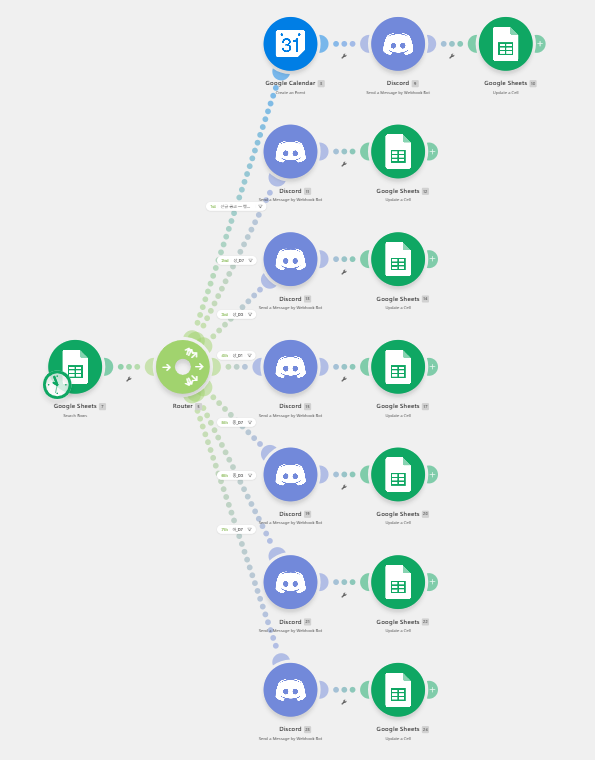 |
| Search Rows 설정 | 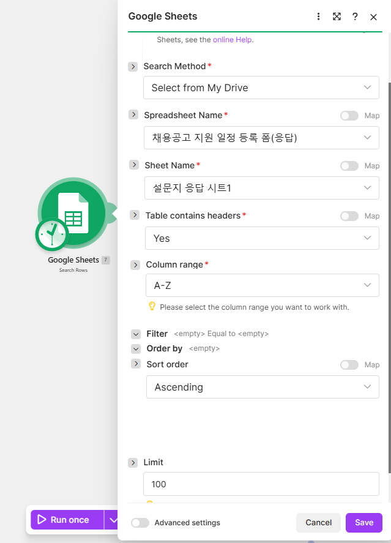 |
| 신규 공고 캘린더 미등록 필터 | 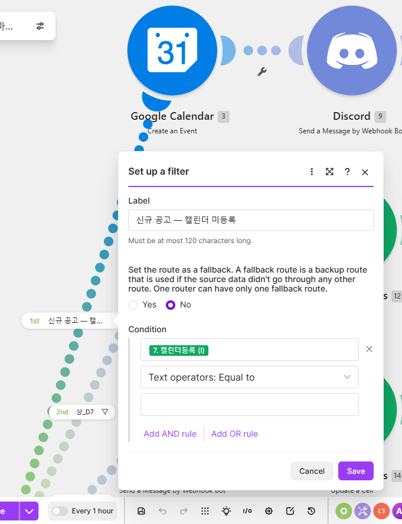 |
| Google Calendar 일정 생성 설정 | 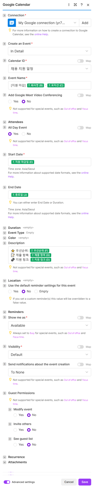 |
| Discord 신규 공고 Embed 설정 | 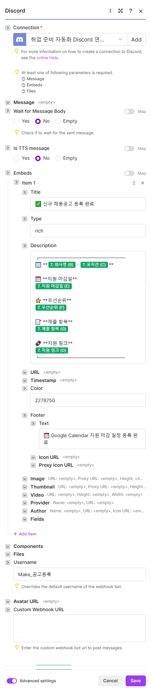 |
| 캘린더등록 완료 Update Cell | 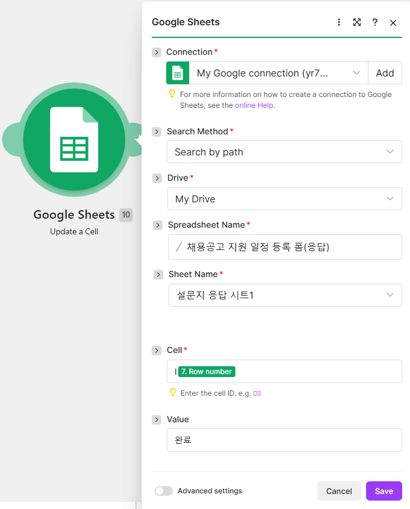 |
| 상_D7 대표 필터 | 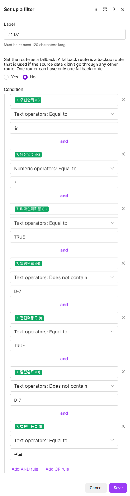 |
| 상_D7 대표 리마인더 Embed | 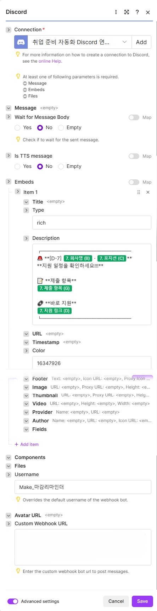 |
| 알림완료 Update Cell | 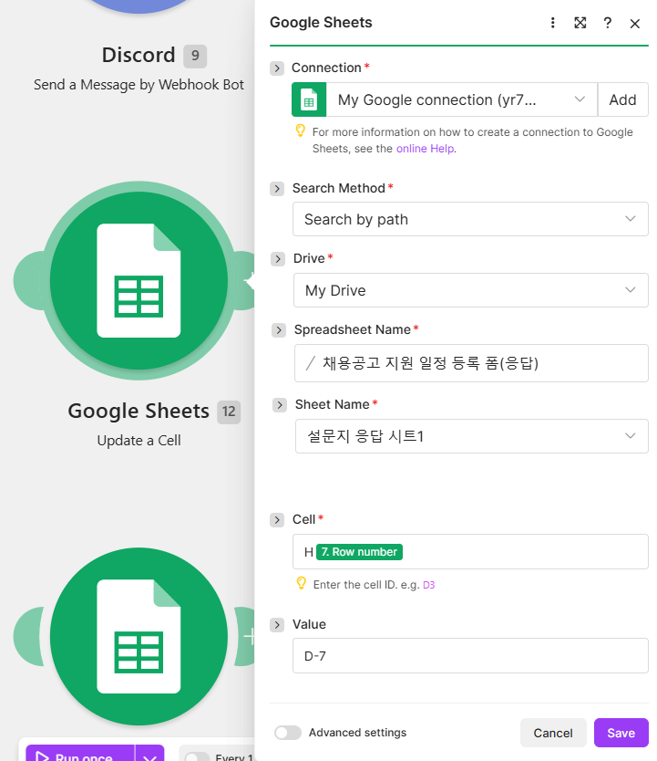 |

#### 9.3 테스트 실행과 결과

| 항목 | 이미지 |
|---|---|
| Google Form 테스트 응답 6건 | 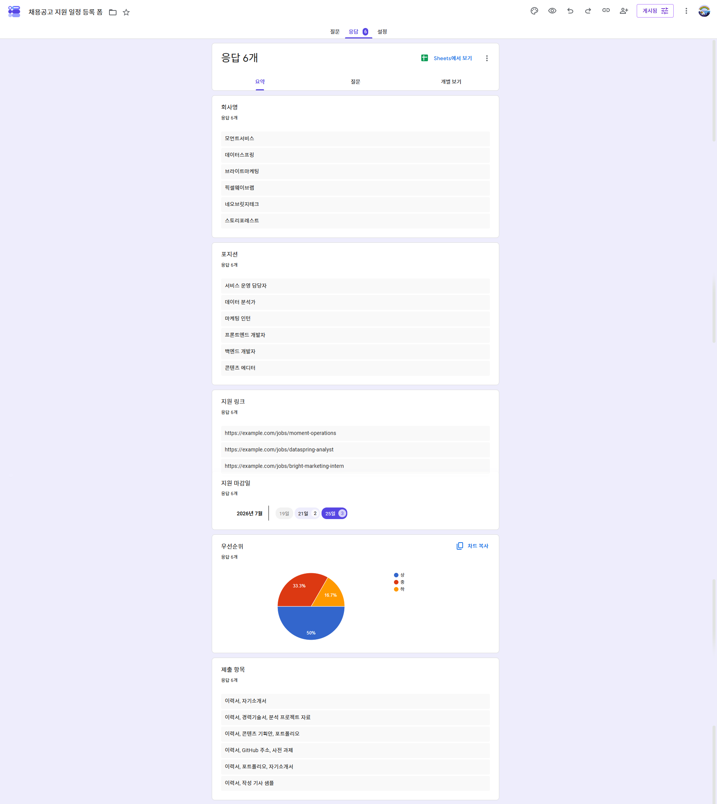 |
| Google Sheets 실행 전 상태 | 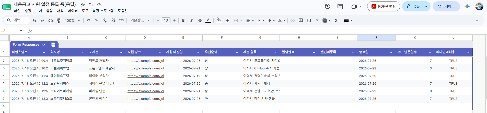 |
| 1차 실행 신규 공고 6건 | 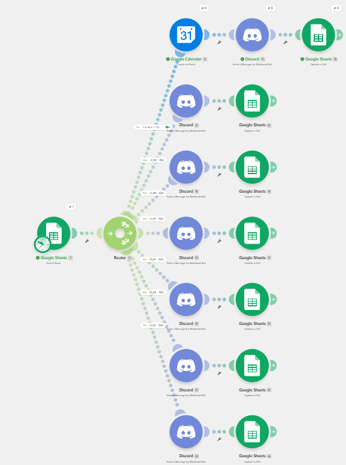 |
| Google Calendar 테스트 일정 6건 | 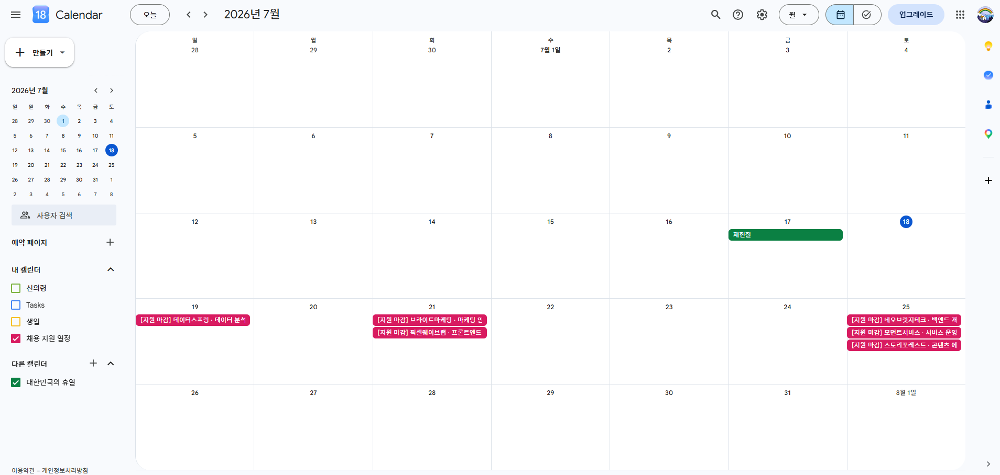 |
| Discord 신규 공고 Embed 결과 | 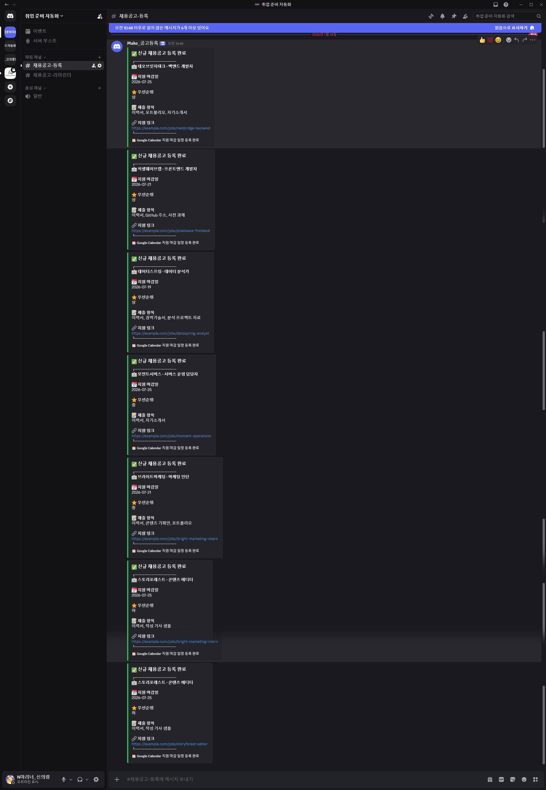 |
| Sheets 캘린더등록 완료 결과 | 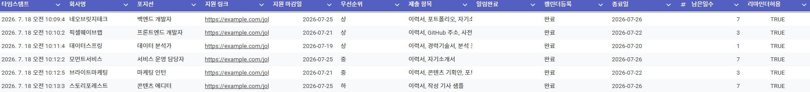 |
| 2차 실행 리마인더 6개 경로 | 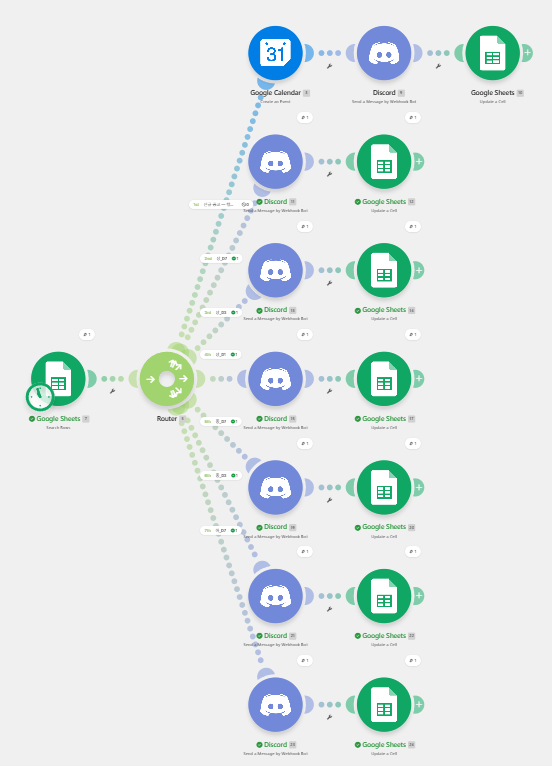 |
| Discord 리마인더 색상별 결과 | 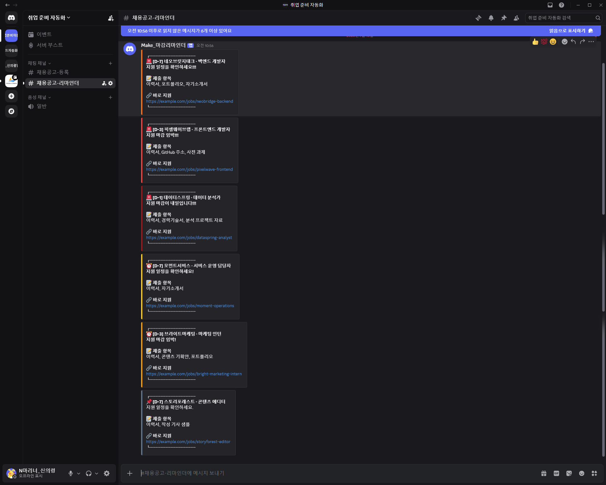 |
| Sheets 알림완료 결과 | 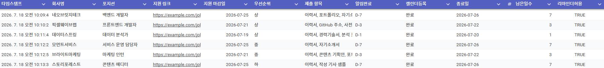 |
| 3차 실행 중복 발송 차단 | 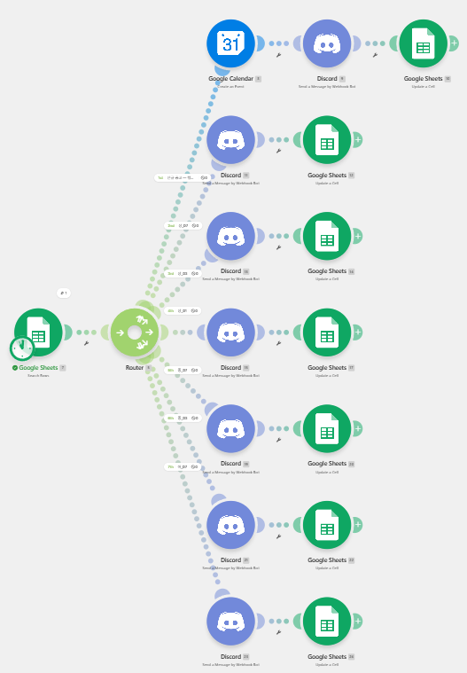 |
| Make History 전체 실행 목록 | 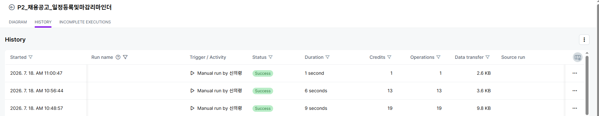 |
| 리마인더 실행 상세 로그 |  |
| Every 1 Hour 자동 실행 ON | 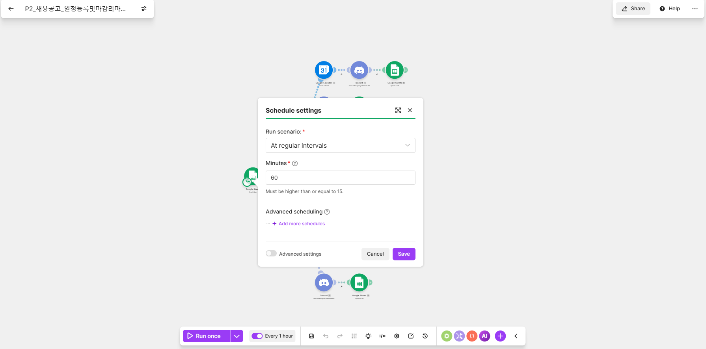 |

> Discord Webhook URL, Google 계정 이메일, 연결 계정 정보 등 민감정보는 캡처에서 제외하거나 마스킹했다.

### 10. 한계와 개선 방향

- 현재 리마인더 단계는 `상_D7·D3·D1`, `중_D7·D3`, `하_D7`로 고정되어 있어 사용자가 원하는 알림 주기를 직접 선택할 수 없다.
- H열에는 마지막 발송 상태만 저장하므로, 더 복잡한 발송 이력 관리가 필요하면 별도 로그 시트를 두는 방식이 적합하다.
- Search Rows 방식은 데이터가 많아질수록 매시간 조회 범위가 커질 수 있으므로, 장기 운영 시에는 처리 대상 조건을 더 좁히거나 별도 상태 테이블을 사용할 수 있다.
- 지원 완료, 서류 결과, 면접 일정 등 이후 단계까지 확장하면 채용 지원 관리 파이프라인으로 발전시킬 수 있다.
- Discord 외에 이메일 또는 모바일 알림을 추가하면 실사용성이 높아진다.

### 11. 프로젝트 2 결론

프로젝트 2에서는 하나의 Make 시나리오 안에서 신규 일정 등록과 6개 리마인더 경로를 함께 구현했다. Google Sheets의 상태 열을 단순 기록 용도가 아니라 다음 실행의 조건으로 활용하여, 매시간 같은 행을 조회하더라도 동일한 Calendar 일정이나 Discord 알림이 반복되지 않도록 설계했다.

또한 리마인더 우선순위와 남은 일수를 색상과 문구로 구분하여 실제 사용자가 빠르게 긴급도를 판단할 수 있도록 개선했다. 최종 테스트에서 신규 공고 6건 등록, 리마인더 6개 경로 실행, 세 번째 실행의 중복 차단까지 모두 정상 작동했다.

---

## 종합 결론

프로젝트 1에서는 동일한 업무를 Make와 Zapier로 구현하여 도구 선택 기준을 비교했고, 프로젝트 2에서는 비교 결과를 바탕으로 분기와 상태 관리가 많은 실제 업무형 자동화를 Make로 확장했다.

Zapier는 단계형 UI와 공식 앱 연동이 직관적이었지만 무료 환경에서 복수 분기를 관리하려면 Zap을 나누어야 했다. Make는 초기 학습 난도가 더 높았지만 Router, 필터, 상태값 기록을 한 화면에서 관리할 수 있어 복잡한 자동화에 더 적합했다.

두 프로젝트를 통해 Trigger와 Action을 연결하는 수준을 넘어, 조건 분기, 시간대와 날짜 형식, 중복 방지, 로그 확인, 무료 플랜의 실행량까지 고려해야 실제로 유지 가능한 자동화가 된다는 점을 확인했다.

---

## 최종 요구사항 점검

| 평가 기준 | 충족 근거 | 판정 |
|---|---|---|
| 프로젝트 1에서 서로 다른 도구 2개 이상 사용 | Make와 Zapier로 동일한 퀴즈 분류 흐름 구현 | 충족 |
| 동일한 워크플로우 구조 | 동일 입력·80점 기준·Sheets 기록·Discord 알림 유지 | 충족 |
| 도구별 구성 및 실행 결과 캡처 | 프로젝트 1 이미지 01~30 | 충족 |
| 비교 항목 최소 5개 | 무료 플랜, 분기, 진입 장벽, 연동, 로그, 유지보수 등 6개 | 충족 |
| 도구별 장단점과 적합 상황 | 별도 장단점 표 및 상황별 추천 작성 | 충족 |
| 프로젝트 2 반복 업무 정의 | 채용공고 정리·Calendar 등록·리마인더 업무 정의 | 충족 |
| 프로젝트 2 도구 선정 이유 | Router·HTTP·무료 환경·유지보수 기준으로 Make 선정 | 충족 |
| Trigger 1개 이상 | 프로젝트 1 신규 행 감지, 프로젝트 2 Scheduler | 충족 |
| Action 2개 이상 | Sheets·Discord·Calendar·상태 업데이트 | 충족 |
| Filter/Router 1개 이상 | 프로젝트 1 합격·불합격, 프로젝트 2 Router 7개 경로 | 충족 |
| 각 분기 1회 이상 실행 | 프로젝트 1 양쪽 경로 및 프로젝트 2 리마인더 6개 경로 실행 | 충족 |
| 프로젝트 2 자동 실행 | `Every 1 hour` 스케줄 ON 캡처 | 충족 |
| 민감정보 보호 | Webhook URL·이메일·연결 계정 정보 마스킹 | 충족 |

> 제출 시 `README.md`와 `images` 폴더를 동일한 저장소에 함께 업로드해야 이미지 링크가 정상적으로 표시된다.

---

## 부록. 전체 캡처 파일 목록

### 프로젝트 1 — 01~30

| 번호 | 파일명 | 내용 |
|---:|---|---|
| 01 | `01_Make_대시보드_무료플랜.png` | Make 무료 플랜 대시보드 |
| 02 | `02_Zapier_대시보드_Pro무료체험.png` | Zapier Pro 무료 체험 대시보드 |
| 03 | `03_Make_전체시나리오_Router분기.png` | Make 전체 시나리오와 Router 분기 |
| 04 | `04_Make_Router_합격필터_80점이상.png` | Make 합격 경로 필터 |
| 05 | `05_Make_Router_불합격필터_80점미만.png` | Make 불합격 경로 필터 |
| 06 | `06_Make_합격경로_실행성공.png` | Make 합격 경로 실행 성공 |
| 07 | `07_Make_불합격경로_실행성공.png` | Make 불합격 경로 실행 성공 |
| 08 | `08_Make_GoogleSheets_합격자탭_기록결과.png` | Make 합격자 탭 기록 결과 |
| 09 | `09_Make_GoogleSheets_불합격자탭_기록결과.png` | Make 불합격자 탭 기록 결과 |
| 10 | `10_Make_Discord_합격불합격_알림결과.png` | Make Discord 합격·불합격 알림 |
| 11 | `11_Make_History_전체실행목록.png` | Make 실행 History 전체 |
| 12 | `12_Make_History_합격경로_상세로그.png` | Make 합격 경로 상세 로그 |
| 13 | `13_Make_History_불합격경로_상세로그.png` | Make 불합격 경로 상세 로그 |
| 14 | `14_Zapier_합격Zap_전체구성.png` | Zapier 합격 처리 Zap 전체 구성 |
| 15 | `15_Zapier_트리거_GoogleSheets설정.png` | Zapier Google Sheets Trigger 설정 |
| 16 | `16_Zapier_합격필터_80점이상.png` | Zapier 합격 필터 |
| 17 | `17_Zapier_시간대변환_Formatter설정.png` | Zapier UTC → Asia/Seoul 변환 |
| 18 | `18_Zapier_합격자시트_Action매핑.png` | Zapier 합격자 시트 Action 매핑 |
| 19 | `19_Zapier_합격Discord_Action설정.png` | Zapier 합격 Discord Action 설정 |
| 20 | `20_Zapier_불합격Zap_전체구성.png` | Zapier 불합격 처리 Zap 전체 구성 |
| 21 | `21_Zapier_불합격필터_80점미만.png` | Zapier 불합격 필터 |
| 22 | `22_Zapier_불합격자시트_Action매핑.png` | Zapier 불합격자 시트 Action 매핑 |
| 23 | `23_Zapier_불합격Discord_Action설정.png` | Zapier 불합격 Discord Action 설정 |
| 24 | `24_Zapier_두Zap_Live목록.png` | 합격·불합격 Zap 활성화 목록 |
| 25 | `25_Zapier_최종결과_합격자시트.png` | Zapier 합격자 시트 최종 결과 |
| 26 | `26_Zapier_최종결과_불합격자시트.png` | Zapier 불합격자 시트 최종 결과 |
| 27 | `27_Zapier_최종결과_Discord알림.png` | Zapier Discord 합격·불합격 최종 알림 |
| 28 | `28_Zapier_History_전체실행목록.png` | Zapier 성공·Filtered 실행 목록 |
| 29 | `29_Zapier_History_Filtered_상세로그.png` | Zapier Filtered 상세 로그 |
| 30 | `30_Zapier_TaskUsage_사용량현황.png` | Zapier Task 사용량 현황 |

### 프로젝트 2 — 31~57

| 번호 | 파일명 | 내용 |
|---:|---|---|
| 31 | `31_P2_GoogleForm_채용공고입력화면.png` | Google Form 채용공고 입력 화면 |
| 32 | `32_P2_GoogleSheets_응답시트_초기구조.png` | Google Sheets 응답 시트 초기 구조 |
| 33 | `33_P2_GoogleSheets_종료일J2_ARRAYFORMULA설정.png` | J2 종료일 ARRAYFORMULA |
| 34 | `34_P2_GoogleSheets_남은일수K2_ARRAYFORMULA설정.png` | K2 남은일수 ARRAYFORMULA |
| 35 | `35_P2_GoogleSheets_리마인더허용L2_ARRAYFORMULA설정.png` | L2 리마인더 허용 ARRAYFORMULA |
| 36 | `36_P2_Make_전체시나리오_Router7경로.png` | Make 전체 시나리오와 Router 7개 경로 |
| 37 | `37_P2_Make_SearchRows_설정.png` | Search Rows 설정 |
| 38 | `38_P2_Make_신규공고_캘린더미등록필터.png` | 신규 공고 캘린더 미등록 필터 |
| 39 | `39_P2_Make_GoogleCalendar_일정생성설정.png` | Google Calendar 일정 생성 설정 |
| 40 | `40_P2_Make_Discord_신규공고Embed설정.png` | Discord 신규 공고 Embed 설정 |
| 41 | `41_P2_Make_UpdateCell_캘린더등록완료설정.png` | I열 캘린더등록 완료 설정 |
| 42 | `42_P2_Make_상D7_대표필터설정.png` | 상_D7 대표 필터 설정 |
| 43 | `43_P2_Make_상D7_대표리마인더Embed설정.png` | 상_D7 대표 리마인더 Embed 설정 |
| 44 | `44_P2_Make_UpdateCell_알림완료설정.png` | H열 알림완료 설정 |
| 45 | `45_P2_GoogleForm_테스트응답6건.png` | Google Form 테스트 응답 6건 |
| 46 | `46_P2_GoogleSheets_테스트응답6건_실행전.png` | Make 실행 전 Google Sheets 상태 |
| 47 | `47_P2_Make_1차실행_신규공고6건.png` | 1차 실행 신규 공고 6건 |
| 48 | `48_P2_GoogleCalendar_테스트일정6건.png` | Google Calendar 테스트 일정 6건 |
| 49 | `49_P2_Discord_신규공고Embed_알림결과.png` | Discord 신규 공고 Embed 알림 결과 |
| 50 | `50_P2_GoogleSheets_캘린더등록완료_결과.png` | Google Sheets 캘린더등록 완료 결과 |
| 51 | `51_P2_Make_2차실행_리마인더6경로.png` | 2차 실행 리마인더 6개 경로 |
| 52 | `52_P2_Discord_리마인더Embed_색상별결과.png` | Discord 리마인더 색상별 결과 |
| 53 | `53_P2_GoogleSheets_알림완료_결과.png` | Google Sheets 알림완료 결과 |
| 54 | `54_P2_Make_3차실행_중복발송차단.png` | 3차 실행 중복 발송 차단 |
| 55 | `55_P2_Make_History_전체실행목록.png` | Make History 전체 실행 목록 |
| 56 | `56_P2_Make_History_리마인더실행_상세로그.png` | 리마인더 실행 상세 로그 |
| 57 | `57_P2_Make_자동실행_Every1Hour_ON.png` | Every 1 Hour 자동 실행 ON |
